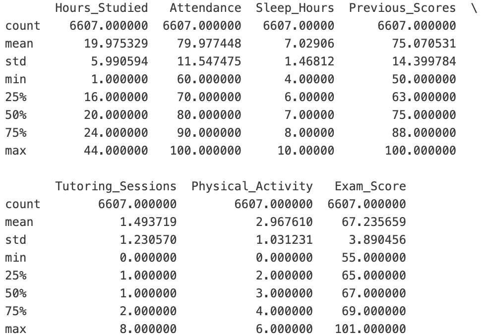
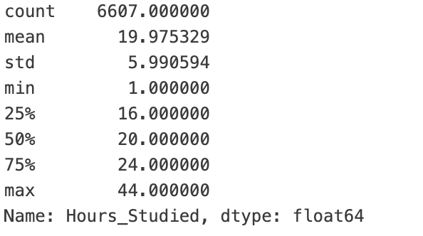
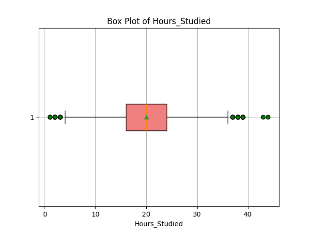

This is my second mini project for the IDS 706 

# **Project Overview**
This project uses the **Students Performance Factors** dataset from Kaggle, which contains information about factors that can influence student grades. The primary goal of the project is to analyze this dataset by generating descriptive statistics and visualizations to better understand how various factors, such as **hours studied**, affect student performance.

# **Purpose**
The purpose of this project is to **automate the generation of descriptive statistics and visualizations using Pandas**. The project involves writing Python functions to load the dataset, perform basic statistical analysis, and create plots for visual insights.

# **Main Components**
1. **Data Loading**:
   A function to load the dataset from a CSV file (`load_dataset`). This function reads the dataset from a specified file path and stores the data in a pandas DataFrame, providing the foundation for further analysis.

2. **Statistical Summaries**:
   The `general_describe` function computes and returns **descriptive statistics** for any specified column in the dataset. This includes commonly used measures such as **mean**, **median**, **minimum**, and **maximum** values, providing a high-level overview of the distribution.

# **General Overview**

# **Hours Studied Overview**

3. **Visualizations**: I mainly focus on the studied hours students made and their exam scores.

- **Scatter Plot**: The `generate_vis` function creates **scatter plots** to visualize the relationship between studied hours and exam scores, allowing users to explore potential correlations.

  

- **Distribution Plot**: The `generate_dist` function generates **histograms** to display the frequency distribution of studied hours, helping to see the central tendency and spread of the data.

  

- **Box Plot**: The `visualize_boxplot` function creates **box plots** that summarize the distribution of studied hours, highlighting the **median**, **quartiles**, and **outliers**.

  

4. **Report Generation**:
   The `save_to_md` function generates a basic **markdown text file** that can later be expanded into more detailed reports based on the analysis conducted.

# **Testing and Validation**
The **test suite** is written in the `test_main.py` file to ensure that the functions work correctly. The tests include:

- **Testing Descriptive Statistics**: The `test_general_describe` function verifies that the computed statistics for the `'Hours_Studied'` column match expected values, such as the **mean**, **median**, **standard deviation**, and **quartile ranges**.

- **Testing Visualizations**: The visualizations, including **scatter plots**, **histograms**, and **box plots**, are validated by the respective test functions to ensure that they run without errors.

# **Visualizations and Reports**
For this project, a variety of **visualizations** were generated from the dataset, including scatter plots, histograms, and box plots. A **sample report**, along with the visualizations and generated data summaries, has been included in the project. These visualizations provide an intuitive understanding of the dataset and highlight important trends and patterns, such as how the number of **hours studied** impacts **exam scores**.
